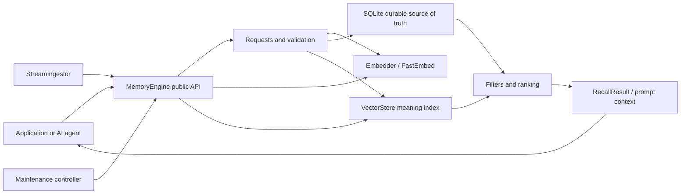
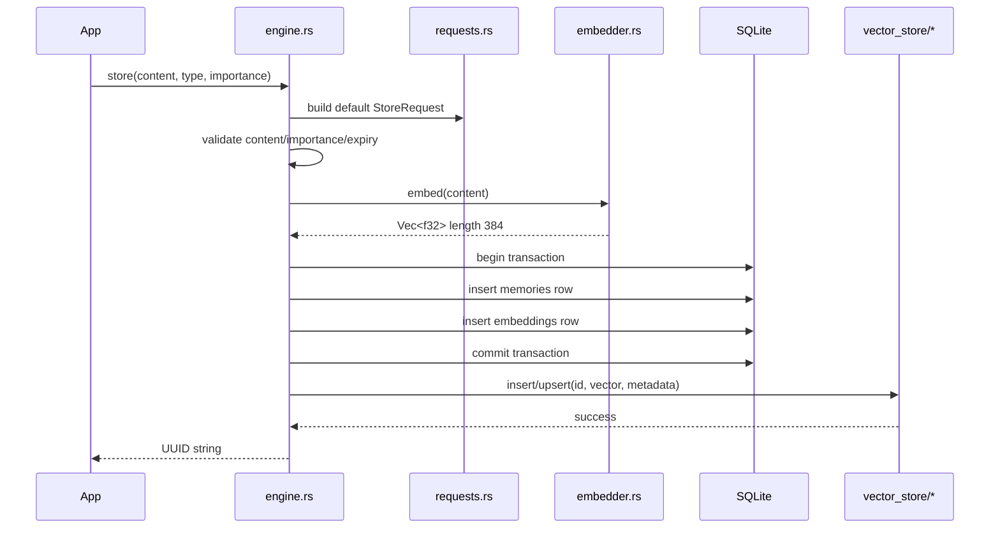
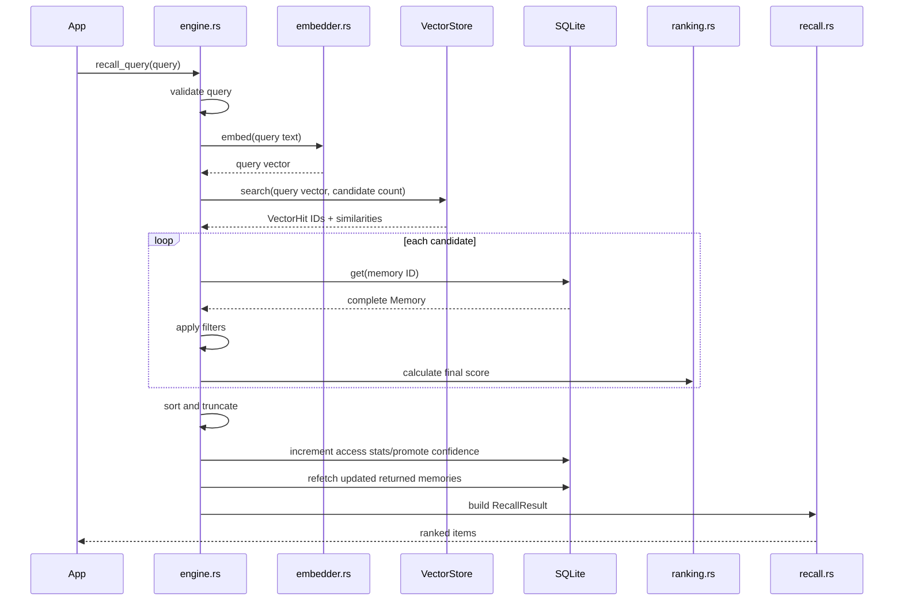
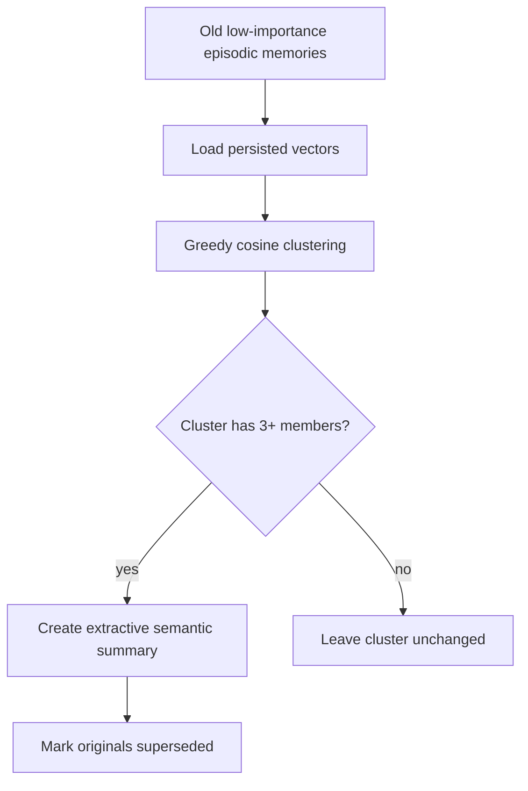

# Memolite: Final Project Understanding

This document explains Memolite from first principles: what exists today, what the chosen V6 plan will add, how one memory moves through the complete system, how SQLite and vector search cooperate, which files call which other files, and which parts matter most.

It reconciles three sources:

1. The current repository, which is the source of truth for what is implemented now.
2. The original ContextMemory product vision, which explains the intended product.
3. The V6 master build plan, which is the chosen target architecture.

> Important distinction: sections marked **Current** describe code that exists now. Sections marked **Target** describe the finished system after V6 is implemented. Planned files are not present in the repository yet.

---

## 1. The project in one sentence

Memolite is a local memory engine for AI agents: it stores facts and experiences permanently, converts their meaning into mathematical vectors, retrieves relevant memories, ranks them using usefulness signals, and gradually expires or compresses old information.

A normal database answers:

> “Give me the row whose ID is `abc`.”

Memolite additionally answers:

> “Which stored memories are most useful for understanding this new sentence?”

### Layman analogy

Imagine an assistant with three pieces of equipment:

- A **filing cabinet**: SQLite stores the exact text and facts permanently.
- A **meaning map**: the vector store places similar ideas near each other.
- A **librarian**: the ranking system decides which nearby documents are actually worth returning.

SQLite remembers exactly. Embeddings find semantically similar ideas. Ranking decides what matters now.

---

## 2. Current state versus finished state

### Current repository

The current code can:

- Open or create a SQLite database.
- Create `memories` and `embeddings` tables.
- Store a memory with a UUID, timestamps, type, importance and expiry.
- Generate a 384-dimensional local embedding using FastEmbed.
- Store that embedding as a Bincode blob in SQLite.
- Fetch and forget memories by ID.
- Purge expired memories.
- Return typed `MemoliteError` values.

The current `recall()` is still `todo!()`. There is no searchable vector store, ranking module, request API, streaming ingestor, confidence system, compression, maintenance controller, statistics API or HTTP vector backend yet.

### Finished V6 target

The finished project adds:

- A pluggable `VectorStore` interface.
- An in-memory cosine-similarity index.
- Restart reconstruction of that index from SQLite.
- Ranked and filtered semantic recall.
- `StoreRequest`, `MemoryUpdate` and explicit expiry policies.
- Confidence levels and promotion.
- Temporal queries and stale-memory detection.
- Streaming ingestion through a bounded Tokio channel.
- Episodic-memory compression.
- Automatic purge/compression maintenance.
- Statistics and Criterion benchmarks.
- An optional generic HTTP vector backend.

---

## 3. Final architecture at a glance



The central rule is:

> SQLite owns durable truth. The vector store is a searchable index that can be rebuilt from SQLite.

If the process restarts, the in-memory vector index disappears. SQLite does not. During `open()`, Memolite reads persisted embeddings from SQLite and reconstructs the vector index.

---

## 4. Final folder and file structure

```text
memolite/
├── Cargo.toml
├── Cargo.lock
├── README.md
├── ARCHITECTURE.md                 # planned final engineering reference
├── finalunderstanding.md           # this beginner-friendly system guide
├── src/
│   ├── lib.rs                      # crate map and public exports
│   ├── engine.rs                   # central orchestrator and public API
│   ├── memory.rs                   # Memory and MemoryType data model
│   ├── error.rs                    # MemoliteError and Result<T>
│   ├── embedder.rs                 # text -> 384-number embedding
│   ├── migrations.rs               # SQLite schema and schema versions
│   ├── recall.rs                   # RecallQuery, RecallItem, RecallResult
│   ├── ranking.rs                  # recency/reinforcement/final score
│   ├── requests.rs                 # StoreRequest, MemoryUpdate, ExpiryPolicy
│   ├── confidence.rs               # ConfidenceLevel and confidence migration
│   ├── streaming.rs                # bounded live ingestion pipeline
│   ├── compression.rs              # eligibility, clustering, summarization
│   ├── maintenance.rs              # scheduled purge/compression controller
│   ├── stats.rs                    # MemoryStats
│   └── vector_store/
│       ├── mod.rs                  # VectorStore contract and shared types
│       ├── in_memory.rs            # local RwLock<HashMap> implementation
│       └── generic_http.rs          # optional feature-gated HTTP adapter
├── tests/
│   ├── crud_test.rs
│   ├── purge_test.rs
│   ├── recall_test.rs              # planned
│   ├── migration_test.rs           # planned
│   ├── update_test.rs              # planned
│   ├── streaming_test.rs           # planned
│   ├── compression_test.rs         # planned
│   ├── maintenance_test.rs         # planned
│   └── send_sync.rs                # planned compile-time concurrency proof
├── benches/
│   └── memolite_bench.rs           # planned Criterion benchmarks
├── examples/
│   ├── basic.rs
│   ├── embed_test.rs
│   └── streaming_ingest.rs         # planned
└── Changelogs/
    ├── 8thjuly.md
    └── 9thjuly.md
```

### What each major folder does

- `src/`: production library code.
- `tests/`: black-box tests that use Memolite the way an external caller would.
- `benches/`: performance experiments, not correctness tests.
- `examples/`: small runnable programs showing public API usage.
- `Changelogs/`: historical notes about completed milestones.
- `target/`: generated Rust build output. Never edit it manually.

---

## 5. The most important files, ranked

| Importance | File | Why it matters |
|---:|---|---|
| 1 | `src/engine.rs` | Coordinates every major operation and owns the database, embedder and vector backend. |
| 2 | `src/memory.rs` | Defines the central data that every module reads and writes. |
| 3 | `src/vector_store/mod.rs` | Defines the boundary between Memolite and any vector-search backend. |
| 4 | `src/migrations.rs` | Protects persisted data as the schema evolves. |
| 5 | `src/recall.rs` | Defines what callers can ask for and what recall returns. |
| 6 | `src/ranking.rs` | Encodes the main product idea: similar is not always the same as useful. |
| 7 | `src/embedder.rs` | Converts language into vectors that semantic search can compare. |
| 8 | `src/requests.rs` | Makes storing and updating explicit, typed and difficult to misuse. |
| 9 | `src/error.rs` | Gives every failure a stable, inspectable meaning. |
| 10 | `src/compression.rs` | Controls long-term consolidation of low-value episodic clutter. |

If you only study five files first, read `memory.rs`, `engine.rs`, `embedder.rs`, `vector_store/mod.rs`, then `recall.rs`.

---

## 6. The core data model

### `MemoryType`

The four memory categories represent different kinds of knowledge:

| Type | Example | Default lifetime |
|---|---|---:|
| Semantic | “The user prefers dark mode.” | 365 days |
| Episodic | “The user debugged login yesterday.” | 30 days |
| Procedural | “Deploy by running this command sequence.” | 730 days |
| Working | “The current task is fixing parser tests.” | 4 hours |

Analogy:

- Semantic memory is a fact book.
- Episodic memory is a diary.
- Procedural memory is a recipe book.
- Working memory is a sticky note on the desk.

### `Memory`

The final `Memory` concept contains:

```rust
pub struct Memory {
    pub id: Uuid,
    pub content: String,
    pub memory_type: MemoryType,
    pub importance: f32,
    pub access_count: u32,
    pub created_at: DateTime<Utc>,
    pub last_accessed: DateTime<Utc>,
    pub expires_at: Option<DateTime<Utc>>,
    pub metadata: HashMap<String, Value>,
    pub superseded_by: Option<Uuid>,
    pub confidence: ConfidenceLevel,
}
```

Key ideas:

- `id`: permanent identity of this exact version.
- `importance`: caller-supplied value from `0.0` to `1.0`.
- `access_count`: how often successful recall returned it.
- `expires_at`: when it becomes eligible for deletion; `None` means never.
- `metadata`: flexible JSON such as project, source or conversation ID.
- `superseded_by`: points to a newer replacement instead of destroying history.
- `confidence`: whether the fact was explicit, inferred or reinforced.

---

## 7. SQLite explained from zero

SQLite is a database stored in one local file. It does not require a separate database server.

Think of it as a highly organized spreadsheet inside `memolite.db`, with rules, indexes and transactions.

### Tables

The `memories` table stores human-readable memory data:

```sql
CREATE TABLE memories (
    id            TEXT PRIMARY KEY,
    content       TEXT NOT NULL,
    type          TEXT NOT NULL,
    importance    REAL NOT NULL,
    access_count  INTEGER NOT NULL,
    created_at    INTEGER NOT NULL,
    last_accessed INTEGER NOT NULL,
    expires_at    INTEGER,
    superseded_by TEXT,
    metadata      TEXT NOT NULL,
    confidence    TEXT NOT NULL
);
```

The `embeddings` table stores the mathematical representation:

```sql
CREATE TABLE embeddings (
    memory_id TEXT PRIMARY KEY,
    vector    BLOB NOT NULL,
    dimension INTEGER NOT NULL,
    FOREIGN KEY(memory_id) REFERENCES memories(id) ON DELETE CASCADE
);
```

Why two tables?

- `memories` is ordinary structured information.
- `embeddings` contains a large binary vector.
- Separating them keeps normal memory queries readable and allows embedding-specific validation.

### Rows and columns

A table is like a spreadsheet:

- Column: one property, such as `content`.
- Row: one complete memory.
- Primary key: the unique ID identifying a row.

### SQL parameters

Memolite uses placeholders:

```rust
conn.execute(
    "DELETE FROM memories WHERE id = ?1",
    rusqlite::params![id],
)?;
```

`?1` is filled safely by Rusqlite. Do not build SQL by concatenating user text; parameters avoid quoting bugs and SQL injection.

### Transactions

A transaction means “all changes succeed together, or none do.”

```rust
let tx = conn.transaction()?;
tx.execute("INSERT INTO memories ...", params![...])?;
tx.execute("INSERT INTO embeddings ...", params![...])?;
tx.commit()?;
```

Analogy: transferring money requires subtracting from one account and adding to another. If only one half succeeds, the data is wrong. A transaction treats both operations as one sealed package.

Memolite writes the memory row and embedding row in the same SQLite transaction.

### Foreign keys and cascading delete

`embeddings.memory_id` points to `memories.id`. With foreign keys enabled:

```sql
PRAGMA foreign_keys = ON;
```

deleting a memory automatically deletes its persisted embedding because of `ON DELETE CASCADE`.

### Indexes

SQLite indexes are like the index at the back of a book. They speed up common lookups without scanning every page.

Memolite indexes fields such as:

- `created_at`
- `last_accessed`
- `type`
- `expires_at`
- `superseded_by`

### Migrations

A migration is a versioned schema change. It lets an old database safely gain a new column without deleting existing memories.

Example history:

- Version 1: baseline memory and embedding tables.
- Version 2: add the confidence column.

Migrations are like carefully renovating a house while the owner’s belongings remain inside.

---

## 8. Embeddings and vector search in plain English

An embedding turns text into a list of numbers:

```text
"User prefers dark mode"
        ↓
[0.012, -0.087, 0.144, ... 384 values total]
```

The numbers are not individually meaningful to humans. Together, they form a location on a high-dimensional “meaning map.” Similar sentences tend to have vectors pointing in similar directions.

### Cosine similarity

Cosine similarity compares directions:

- Near `1.0`: very similar direction/meaning.
- Near `0.0`: largely unrelated.
- Negative: opposing directions in the mathematical space.

Analogy: two arrows can start at the same point. Cosine similarity asks whether they point the same way, not whether one arrow is longer.

### Why SQLite is not enough

SQLite can efficiently match IDs, types and timestamps. It does not natively understand that “dark theme” resembles “night mode.” The vector index performs that semantic candidate search.

### Why the vector index is not enough

The vector backend knows IDs, vectors, similarity and optional metadata. SQLite owns complete durable memory records, expiry, supersession, confidence and access history.

---

## 9. `MemoryEngine`: the coordinator

The final engine owns four important things:

```rust
pub struct MemoryEngine {
    conn: Mutex<rusqlite::Connection>,
    embedder: Mutex<Embedder>,
    vector_store: RwLock<Arc<dyn VectorStore>>,
    maintenance_running: Arc<AtomicBool>,
}
```

### Why the locks exist

- `Mutex<Connection>`: one SQLite connection must not be used simultaneously by multiple tasks.
- `Mutex<Embedder>`: FastEmbed’s `embed()` needs mutable access.
- `RwLock<Arc<dyn VectorStore>>`: many operations read the selected backend; rare operations may replace/reconfigure the backend reference.
- `AtomicBool`: prevents two maintenance controllers from running simultaneously.

Analogy: a lock is a bathroom key. One person temporarily holds it, performs a short operation, and returns it. Crucially, Memolite releases normal Rust locks before `.await`; otherwise a task could go to sleep while still holding the key.

---

## 10. Complete store flow

Suppose the application calls:

```rust
let id = engine
    .store("The user prefers dark mode", MemoryType::Semantic, 0.9)
    .await?;
```

### Call chain



### Detailed steps

1. `engine.rs` validates nonempty content and importance in `0.0..=1.0`.
2. It creates a UUID and timestamps.
3. `requests.rs` supplies default expiry behavior where applicable.
4. `embedder.rs` generates the vector before opening the database transaction.
5. The vector is serialized with Bincode for SQLite.
6. One SQLite transaction inserts both durable rows.
7. After committing and releasing the database lock, the vector backend is updated.
8. If vector insertion fails, Memolite compensates by deleting the new SQLite memory.
9. The generated ID returns to the caller.

Why embed first? Model work is slower and can fail. There is no reason to hold a database transaction open while the model runs.

Why SQLite first? It is the durable source of truth. The vector store is secondary and reconstructable.

---

## 11. Complete recall flow

Suppose the application asks:

```rust
let result = engine
    .recall_query(
        RecallQuery::new("What interface does the user like?")
            .limit(5)
            .min_importance(0.3),
    )
    .await?;
```

### Call chain



### Candidate search versus final ranking

The vector store first returns semantically similar candidates. Memolite deliberately fetches more candidates than the requested final limit because filters may remove some.

```rust
pub fn candidate_pool_size(limit: usize) -> usize {
    limit.saturating_mul(5).max(50).min(500)
}
```

If the caller requests 5 results, Memolite may inspect 50 vector candidates, filter and rank them, then return 5.

### Filters

`recall_query()` can exclude or include memories using:

- Minimum importance.
- Allowed memory types.
- Exact metadata key/value matches.
- Expired-memory inclusion.
- Superseded-memory inclusion.
- Creation-time range.
- Stale-only behavior.

### Ranking

The V6 score combines:

```text
final score = similarity
            × importance
            × recency
            × reinforcement
            × confidence weight
```

- Similarity: semantic closeness to the query.
- Importance: caller’s estimate of value.
- Recency: decay since last access, relative to memory type.
- Reinforcement: a modest boost from repeated successful recall.
- Confidence: inferred memories receive less weight until reinforced.

Analogy: searching for a restaurant is not only about physical distance. You also care about rating, whether it is open, whether friends repeatedly recommend it and whether the information is trustworthy.

### Access updates

Only final returned items get their `access_count` and `last_accessed` updated. Candidates examined but discarded do not receive credit.

---

## 12. Updating without destroying history

Memolite uses replacement rather than editing a memory in place.

Example:

```text
A: "User uses VS Code"
          superseded_by
                ↓
B: "User now uses Zed"
```

### Update flow

1. Fetch the old memory.
2. Merge fields from `MemoryUpdate` with preserved old fields.
3. Store a new memory and embedding.
4. Set the old row’s `superseded_by` to the new UUID.
5. Default recall hides A and returns B.
6. Historical recall can request superseded memories.

This is like version control: do not erase the old commit; create a new commit and link history.

### Expiry policies

```rust
pub enum ExpiryPolicy {
    TypeDefault,
    Custom(chrono::Duration),
    Never,
}
```

These are three genuinely different intentions. `Option<Duration>` alone cannot clearly express them all.

---

## 13. Confidence flow

```rust
pub enum ConfidenceLevel {
    Explicit,
    Inferred,
    Reinforced,
}
```

- Explicit: directly stated by a user or trusted caller.
- Inferred: concluded indirectly; ranking weight is lower.
- Reinforced: an inferred memory recalled enough times to earn full weight.

An inferred memory promotes after the configured access threshold. Promotion occurs in the same SQL update as the access-count increment, preventing an off-by-one race.

---

## 14. Restart and reconciliation flow

The default vector store lives only in RAM. When the program stops, it disappears.

On the next `MemoryEngine::open()`:

1. Open SQLite.
2. Enable foreign keys.
3. Run schema migrations.
4. Load the embedding model and determine vector dimension.
5. Create the in-memory vector store.
6. Read every SQLite memory and matching persisted embedding.
7. Validate UUIDs, vector encoding, dimensions and finite values.
8. Call `replace_all(entries)` on the vector backend.
9. Return a ready engine.

### `replace_all`

```rust
async fn replace_all(&self, entries: Vec<VectorEntry>) -> Result<()>;
```

This means: after success, the backend contains exactly these entries—no missing entries and no stale extras.

For the in-memory implementation, a complete replacement map is built first, validated, and swapped under one write lock.

### Backfill policies for custom backends

- `ExistingOnly`: do not write remote data.
- `UpsertLocal`: add/update local rows without deleting unrelated remote rows.
- `ReplaceAll`: make remote contents exactly equal to this SQLite database; only safe for a dedicated collection.

---

## 15. Streaming ingestion flow

Streaming is useful when text arrives in pieces, such as LLM tokens or live conversation fragments.


### Why buffer sentences?

Storing each token would create useless memories such as “The”, “user”, and “prefers”. `SentenceBuffer` waits for sentence boundaries and emits meaningful units.

### Why a bounded channel?

A bounded channel limits queued work. If input arrives faster than storage, senders wait instead of allowing memory usage to grow without limit.

Analogy: a restaurant has a fixed-size order rail. When it is full, waiters pause instead of stacking infinite orders on the floor.

### Shutdown modes

- `shutdown_now()`: stop promptly; queued backlog may be discarded.
- `finish()`: close senders and drain every queued item.

---

## 16. Compression flow

Compression reduces active episodic clutter. It does not necessarily reduce SQLite disk usage because originals remain stored for history.

Eligible memories are:

- Episodic.
- Older than 14 days.
- Importance below `0.3`.
- Not expired.
- Not already superseded.

### Flow



The summary is extractive: it concatenates and bounds original content. It is not an LLM-generated abstractive summary.

The summary uses `Semantic` type so it lasts longer than the episodic originals.

---

## 17. Automatic maintenance

Maintenance is opt-in:

```rust
let handle = engine.start_maintenance(config)?;
// application runs
handle.shutdown().await?;
```

Two independent schedules run:

- Frequent expiry purge.
- Less frequent compression.

`CancellationToken` allows clean shutdown. A `Weak<MemoryEngine>` prevents the worker from keeping an otherwise-unused engine alive forever. An atomic flag prevents duplicate maintenance controllers.

---

## 18. File-to-file call map

| Starting file | Calls/uses | Purpose |
|---|---|---|
| `lib.rs` | Every public module | Defines the crate’s public surface. |
| `engine.rs` | `embedder.rs` | Converts memory/query text to vectors. |
| `engine.rs` | `migrations.rs` | Makes the SQLite schema ready during open. |
| `engine.rs` | `vector_store/mod.rs` | Inserts, searches, deletes and reconciles vectors. |
| `engine.rs` | `memory.rs` | Constructs and returns `Memory` values. |
| `engine.rs` | `requests.rs` | Accepts typed store/update instructions. |
| `engine.rs` | `recall.rs` | Accepts queries and creates results. |
| `engine.rs` | `ranking.rs` | Calculates recency, reinforcement and final scores. |
| `engine.rs` | `confidence.rs` | Persists and promotes confidence. |
| `streaming.rs` | `engine.rs` | Sends completed chunks through normal storage. |
| `compression.rs` | `memory.rs` | Examines candidates and creates summaries. |
| `maintenance.rs` | `engine.rs` | Calls purge and compression on intervals. |
| `generic_http.rs` | `vector_store/mod.rs` | Implements the same backend contract over HTTP. |

---

## 19. Most important code patterns to understand

### Pattern 1: lock, do synchronous work, unlock, then await

```rust
let store = {
    let guard = self.vector_store.read()
        .map_err(|_| MemoliteError::Internal("vector lock poisoned".into()))?;
    Arc::clone(&*guard)
};

store.search(&query_vector, limit).await?;
```

The lock guard disappears before `.await`.

### Pattern 2: durable pair in one transaction

```rust
let tx = conn.transaction()?;
tx.execute("INSERT INTO memories ...", params![...])?;
tx.execute("INSERT INTO embeddings ...", params![...])?;
tx.commit()?;
```

There should never be a newly stored memory without its persisted embedding.

### Pattern 3: typed errors instead of panics

```rust
pub type Result<T> = std::result::Result<T, MemoliteError>;
```

Callers can distinguish database corruption, invalid arguments, embedding failures and backend failures.

### Pattern 4: explicit decoder column order

```rust
const MEMORY_COLUMNS: &str =
    "id, content, type, importance, access_count, created_at, \
     last_accessed, expires_at, superseded_by, metadata, confidence";
```

`row_to_memory()` must read fields in exactly this order. Avoid `SELECT *`, because future schema changes could silently reorder assumptions.

### Pattern 5: compensation across two systems

SQLite and a vector backend cannot share one transaction. Memolite commits SQLite, attempts vector insertion, and compensates if the second system fails.

This is like booking a flight and hotel through separate companies: there is no shared transaction, so if the hotel fails, you deliberately cancel the flight.

---

## 20. What happens during deletion and purge

### Forget one memory

1. Parse and validate its UUID.
2. Delete the SQLite memory.
3. SQLite cascades deletion of the persisted embedding.
4. Delete its live vector entry.
5. If vector deletion fails, reconcile the vector backend from SQLite.

### Purge expired memories

1. Find IDs whose expiry is earlier than now.
2. Delete those SQLite rows.
3. Delete corresponding vector entries.
4. Reconcile on backend failure.
5. Return the number removed.

---

## 21. Testing strategy

Different tests answer different questions:

- Unit tests: does cosine similarity or expiry logic work alone?
- Integration tests: does store → SQLite → vector index → recall work end to end?
- Migration tests: can a real older database open safely?
- Failure-injection tests: does compensation work when one component fails?
- Concurrency tests: do background tasks avoid deadlocks?
- Restart tests: does SQLite reconstruct the transient vector index?
- Benchmarks: how does performance change at 1k, 10k or 100k memories?

Final quality gates:

```powershell
cargo fmt --check
cargo clippy --all-targets --all-features -- -D warnings
cargo test --all-targets --all-features
cargo test
cargo bench
cargo doc --no-deps --all-features
cargo publish --dry-run
```

---

## 22. Honest limitations

- In-memory search is linear: it compares the query against every indexed vector.
- The embedding model may need a large first-run download.
- SQLite is local and excellent for one process, not a distributed database.
- Cross-system SQLite/vector operations use compensation, not a true shared transaction.
- Extractive compression concatenates; it does not deeply understand or rewrite meaning.
- Similarity is not contradiction detection.
- Remote `replace_all` is only as atomic as the remote service promises.
- Updating summary/original relationships is not fully crash-atomic unless performed in one SQLite transaction.

---

## 23. Recommended reading and implementation order

### To understand the project

1. `memory.rs`: learn the nouns.
2. `engine.rs`: learn the workflows.
3. `embedder.rs`: learn how text becomes a vector.
4. `vector_store/mod.rs`: learn the backend contract.
5. `in_memory.rs`: learn the simplest search implementation.
6. `recall.rs` and `ranking.rs`: learn how candidates become answers.
7. `migrations.rs`: learn how data survives software evolution.
8. Streaming, compression and maintenance last.

### To build the project

Follow V6’s feature intent, while keeping each intermediate commit compiling:

1. Foundations, dependencies, errors, vector contract and in-memory backend.
2. Final engine ownership plus matching constructor and baseline migrations.
3. Store/forget and a temporary real cosine recall.
4. Ranked `RecallQuery` API; then delegate simple recall to it.
5. Requests, updates and expiry policy.
6. Confidence schema and ranking integration.
7. Temporal queries.
8. Streaming.
9. Compression and stats.
10. Maintenance.
11. Optional HTTP backend.
12. Benchmarks, documentation and release checks.

---

## 24. A complete real-world example

An AI coding agent hears:

> “I prefer Zed for Rust projects, and I always run Clippy before committing.”

The application may store:

1. Semantic memory: “User prefers Zed for Rust projects,” importance `0.8`.
2. Procedural memory: “Run Clippy before committing,” importance `0.9`.

Weeks later the user asks:

> “What should I do before I commit this Rust change?”

Memolite:

1. Embeds the question.
2. Finds semantically close vectors.
3. Loads complete rows from SQLite.
4. Filters expired/superseded rows.
5. Ranks the procedural memory highly because it is important, durable and relevant.
6. Returns it with score and similarity.
7. Increments its access count.
8. Renders bounded context for the agent:

```text
Relevant memories:
1. [0.91] Run Clippy before committing.
```

If the user later says, “I switched back to VS Code,” Memolite stores a new semantic memory and links the old editor preference through `superseded_by`. History remains available, but normal recall favors the current fact.

That is the complete purpose of the system: durable facts, semantic discovery, typed history, relevance ranking and controlled forgetting in one local Rust library.

